---

### ◉ Live GitHub analytics

  
  
  

### ◉ Contribution field — rebuilt from the GitHub API

  
   
  500 public events across the last 12 months · active days ignite by intensity · snapshot: October 1, 2026

---

### ◉ Repository DNA — animated scan of 46 indexed repos

  

Account total: 89 public + 11 private repositories · 2023 was the foundation year — a new project shipped almost every week.

---

### ◉ Featured builds — pinned

| Project | What it is | Stack |
|---|---|---|
| [**NEXUS — Starship Guardians**](https://github.com/lois4801/NEXUS-Starship-Guardians) | Reusable, multi-project **agentic AI operating system** driving Lucio AI Platform, Ember, and future applications | Python ★1 |
| [**Lucio AI Platform**](https://github.com/lois4801/Lucio-AI-Platform) | Local-first AI platform — chat with fallback, feedback layer, lazy-loaded routes, mobile-overhauled UI | JavaScript ★1 |
| [**Nexus-Code2**](https://github.com/lois4801/Nexus-Code2) | Reconstructing Clawd Code | ★1 |
| [**Multi-Agent AI System**](https://github.com/lois4801/Multi-Agent-AI-System-LatestVersion) | Multi-agent orchestration with graphs, traces, and observable reasoning | LangGraph · LangSmith |
| [**AI Software Architect**](https://github.com/lois4801/ai-software-architect) | Local-first AI software architect for Codex, Claude Code, Copilot and other coding assistants | Python |
| [**awesome-gpt-6-astra**](https://github.com/lois4801/awesome-gpt-6-astra) | Evidence-backed use cases, prompts, integrations, evaluations, and safety notes | Docs |

**[→ Browse all 91 repositories](https://github.com/lois4801?tab=repositories)**

---

### ◉ The journey

**`2021` Genesis** — the account opens in the last days of December: a decision to build in public.
**`2023` The Data Foundation** — 36 repos in twelve months: SQL Server, Power BI, Tableau, Excel pipelines, ML notebooks.
**`2024` Industry Intelligence** — injury-prevention analytics for power companies, root-cause analysis in aerospace.
**`2026` The Agentic Era** — Lucio AI Platform, Ember data studio, multi-agent LangGraph systems, and NEXUS, the agentic OS tying it all together.

### ◉ Currently shipping

- 🟢 **NEXUS — Agentic OS** · actively pushed
- 🟢 **Lucio AI Platform** · improvement pass in review
- 🟢 **Anonato Code** · reimagining the coding agent

### ◉ Toolbox

  

---

### The full interactive experience ↗

**[lois4801.github.io](https://lois4801.github.io)** — animated charts, journey timeline, live particle field, custom cursor.

Open to opportunities · Canada · Data → AI → Agentic Systems

